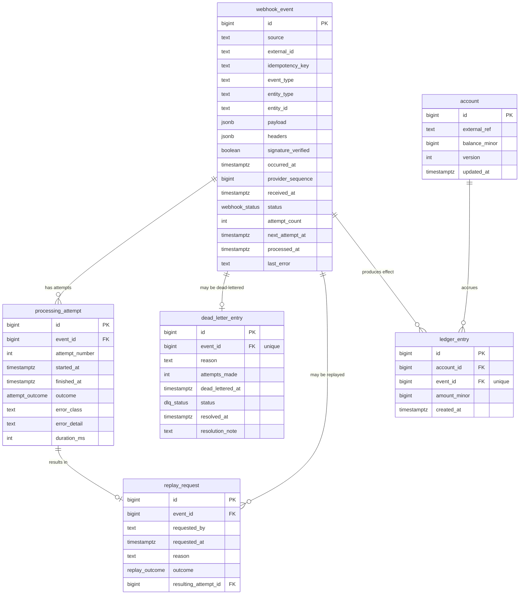

# Idempotent Webhook Receiver (Engineering Spec)

A service that takes provider webhooks (Stripe-style) and holds up under the things that
actually go wrong with at-least-once delivery: duplicate deliveries, events arriving out of
order, partial failures, downstream timeouts.

This is the source of truth for the build. The design prompt and the build prompt both point
back here. Every requirement has an ID and an acceptance check, so it's easy to review the
code against what was asked for.

---

## 0. Background

Providers promise at-least-once delivery, not exactly-once. Exactly-once isn't achievable over
an unreliable network, so nobody offers it. The provider sends an event, waits for a `2xx`, and
resends if it doesn't get one before its timeout.

The awkward part is that the timeout can fire even after we've already processed the event, if
we happened to crash before the response made it back. The provider can't tell "never
processed" apart from "processed, but the ack got lost," so it resends either way.

So the whole design comes down to one question: how do we make a re-delivery safe to accept?
Two decisions fall out of that.

**Accept-and-queue ingestion.** We verify the signature, write the raw event to Postgres, and
return `200` straight away. The actual work happens later, in a worker. Ingestion stays fast
because it's a single insert, a slow or hung downstream never makes the provider wait on us,
and "we received it" is kept separate from "we processed it."

**Idempotency lives in the database, not in application code.** Dedup is a unique constraint.
The business effect is a ledger row keyed by event id. We lean on constraints Postgres enforces
atomically instead of read-then-write checks that fall apart under concurrency.

---

## 1. Functional Requirements

### 1.1 Ingestion

- **FR-1. Ingestion endpoint.** `POST /v1/webhooks/{source}` takes the raw request body and
  headers for a named provider.
  *Acceptance:* a well-formed request returns `200` within the latency budget, and the event is
  written to the database before the response goes out.
- **FR-2. Fast acknowledgement.** Ingestion doesn't block on processing. It writes and returns;
  processing is asynchronous.
  *Acceptance:* ingestion latency stays flat regardless of processing time or downstream health.

### 1.2 Signature verification and security

- **FR-3. HMAC signature verification.** Verify the provider signature (HMAC-SHA256 over
  `timestamp.payload`) with a constant-time comparison.
  *Acceptance:* a tampered body or the wrong secret is rejected with `401` and nothing is
  written.
- **FR-4. Timestamp tolerance.** Reject requests whose signed timestamp falls outside a
  configurable window (default ±300 s), so a captured request can't be replayed later.
  *Acceptance:* a request with a stale timestamp is rejected with `401`.

### 1.3 Deduplication and idempotency

- **FR-5. Idempotency key.** The dedup key is `(source, idempotency_key)`. `idempotency_key`
  defaults to the provider event id (`external_id`) and can be overridden by an
  `Idempotency-Key` header. A unique constraint enforces it.
  *Acceptance:* a repeat delivery of the same event inserts zero new event rows and still
  returns `200`.
- **FR-6. Idempotent effect.** Processing an event produces exactly one effect. The effect
  ledger has a unique constraint on `event_id`, so a re-run can't apply it twice.
  *Acceptance:* processing the same event N times leaves one ledger row and the same final
  state.

### 1.4 Asynchronous processing

- **FR-7. Worker poll.** A worker claims due events with `SELECT ... FOR UPDATE SKIP LOCKED`,
  so two worker instances never grab the same row.
  *Acceptance:* with two workers running, each event is processed once, nothing lost, nothing
  double-claimed.
- **FR-8. Pluggable handlers.** Processing dispatches to a handler per `event_type`. At least
  one realistic handler (a balance/ledger mutation) exists so the double-processing risk is
  something you can actually see and test against.
  *Acceptance:* an unknown event type is handled on purpose (recorded, not quietly dropped).

### 1.5 Concurrency control

- **FR-9. Per-entity serialisation.** Events for the same business entity are processed one at
  a time using `pg_advisory_xact_lock(hash(entity))`. Events for different entities still run in
  parallel. `SKIP LOCKED` stops two workers taking the same row; the advisory lock stops two
  workers taking two different events for the same entity.
  *Acceptance:* firing several events at one entity concurrently ends in the same state as
  running them one by one, and unrelated entities don't block each other.

### 1.6 Ordering

- **FR-10. Out-of-order handling.** Ordering is a separate problem from concurrency, and it's
  treated as one. Each event carries `occurred_at`, plus `provider_sequence` where the provider
  gives us one. Handlers use an optimistic-version guard so a later state can't be clobbered by
  an earlier event that shows up late.
  *Acceptance:* delivering a newer event before an older one leaves the entity in the newer
  state; the stale event is recorded as superseded rather than applied.

### 1.7 Retry and backoff

- **FR-11. Error taxonomy.** Failures are split into retryable (timeout, downstream `5xx`, lock
  contention) and non-retryable (bad payload, business-rule violation).
  *Acceptance:* a non-retryable failure goes to the dead-letter queue immediately without
  burning retries.
- **FR-12. Exponential backoff with jitter.** Retryable failures are rescheduled with
  `delay = min(cap, base * 2^attempt)` plus full jitter, `random(0, delay)`. The jitter RNG is
  seedable so tests stay deterministic.
  *Acceptance:* successive `next_attempt_at` values follow the schedule and don't all line up
  when a batch fails together.
- **FR-13. Max attempts.** After a configurable number of attempts the event is dead-lettered.
  *Acceptance:* the attempt count is bounded and the move to the DLQ is recorded.

### 1.8 Dead-letter queue

- **FR-14. Dead-letter capture.** Events that exhaust their retries or fail non-retryably move
  to the DLQ, keeping the failure reason, the attempts made, and the original context.
  *Acceptance:* a poison event ends up in the DLQ and stops holding up healthy traffic.
- **FR-15. DLQ lifecycle.** DLQ entries carry a status (`needs_review`, `replaying`,
  `resolved`, `discarded`) and resolution metadata.
  *Acceptance:* an operator can triage, resolve, or discard an entry, and the history stays
  intact.

### 1.9 Replay

- **FR-16. Replay endpoint.** An authenticated admin endpoint re-processes a single event, a
  batch, the DLQ, or a time range.
  *Acceptance:* each replay is recorded with who ran it, when, why, and how it went.
- **FR-17. Idempotent replay.** Replay goes through the same dedup, lock, and ledger path, so
  replaying an already-processed event does nothing to its effect.
  *Acceptance:* replaying 10,000 already-processed events adds zero effects.

### 1.10 Admin and observability API

- **FR-18. Event query API.** List and filter events by status, source, type, entity, and time,
  and fetch a single event with its full attempt history.
- **FR-19. Metrics endpoint.** Expose Prometheus metrics at `/metrics`: counters for ingested,
  processed, retried, and dead-lettered events, plus latency histograms.
- **FR-20. Admin authentication.** Admin and replay endpoints require auth (API key or basic
  auth at a minimum). Ingestion authenticates by signature only.
  *Acceptance:* an unauthenticated admin call is rejected with `401`.

### 1.11 Operational endpoints

- **FR-21. Liveness and readiness.** `GET /healthz` for liveness and `GET /readyz` for
  readiness, which checks the database connection.
  *Acceptance:* `/readyz` fails when the database is unreachable.

---

## 2. Non-Functional Requirements

- **NFR-1. Correctness.** No double-processing under duplicate or concurrent delivery. The load
  test checks it directly by replaying ≥10,000 duplicates and asserting
  `count(ledger_entry) == count(distinct events)`.
- **NFR-2. Performance.** Ingestion p99 under a stated budget (target < 50 ms locally), measured
  and written down. Sustained ingestion throughput target, also measured.
- **NFR-3. Durability.** Nothing we've acknowledged is ever lost; the write happens before the
  `200`.
- **NFR-4. Availability and crash-safety.** The app and worker tiers are stateless and scale
  horizontally. A worker that dies mid-processing leaves no half-applied effect, and the event
  gets retried cleanly.
- **NFR-5. Observability.** Structured JSON logs with a correlation id per event, Prometheus
  metrics, and enough in the data model that you can trace any event's state changes from the
  tables alone.
- **NFR-6. Security.** Constant-time signature comparison, timestamp tolerance, admin auth,
  secrets from the environment only, non-root container, no payload PII in logs.
- **NFR-7. Scalability.** Per-entity locking lets different entities run in parallel, so adding
  workers raises throughput until the database becomes the limit.
- **NFR-8. Maintainability.** Layered architecture with clear boundaries, fully type-hinted,
  linted, with an ADR for anything non-obvious.
- **NFR-9. Testability.** Deterministic tests via an injected clock and seedable jitter,
  integration tests against a real Postgres (Testcontainers), and a load test anyone can re-run
  to reproduce the number.
- **NFR-10. Deployability.** Multi-stage Docker build, `docker-compose` for local work, deployed
  to AWS (Fargate + RDS) with the deploy written up in the case study, CI running lint, types,
  and tests on every push.
- **NFR-11. Configurability.** Every threshold (max attempts, backoff base and cap, timestamp
  tolerance, lock timeout, poll batch size) comes from config. No magic numbers in the code.
- **NFR-12. Data lifecycle.** A written-down stance on retention/archival for the event and
  attempt tables, since they grow without bound otherwise.

---

## 3. Data Model (ER Diagram)



### Constraints and indexes that do the real work

- `webhook_event`: **UNIQUE (source, idempotency_key)** is the deduplication guarantee (FR-5).
  Index on `(status, next_attempt_at)` for the worker poll, and on `(entity_type, entity_id)`.
- `ledger_entry`: **UNIQUE (event_id)** is the idempotent-effect guarantee (FR-6). If processing
  runs twice, the second effect insert hits this constraint and does nothing.
- `processing_attempt`: **UNIQUE (event_id, attempt_number)**.
- `dead_letter_entry`: **UNIQUE (event_id)**, one DLQ entry per event.
- `account`: the `version` column backs the optimistic-version guard for ordering (FR-10).

### Enums

- `webhook_status`: `pending | processing | succeeded | dead_lettered`
- `attempt_outcome`: `succeeded | retryable_error | non_retryable_error`
- `dlq_status`: `needs_review | replaying | resolved | discarded`
- `replay_outcome`: `succeeded | skipped_already_processed | failed`

### A note on the demo domain

`account` and `ledger_entry` are illustrative, but they're what let us prove correctness instead
of asserting it. The balance is `SUM(ledger_entry.amount_minor)`, and the unique `event_id`
guarantees one ledger row per event. So the load test can check it directly: count the ledger
rows, count the distinct events, and they have to match. Swap this domain for something else if
you like, but keep the `UNIQUE(event_id)` on whatever the effect table is.

---

## 4. Architecture

Layered, with dependencies pointing inward. The domain layer never imports the framework.

```
  HTTP (FastAPI)         →  api/          routing, request/response schemas, auth, signature
  Application services   →  services/     ingest, process, retry, dlq, replay orchestration
  Domain                 →  domain/       event model, error taxonomy, backoff policy, handlers
  Adapters               →  adapters/     SQLAlchemy repositories, advisory-lock helper, clock, rng
  Worker                 →  worker/       poll loop (FOR UPDATE SKIP LOCKED) + dispatch
  Cross-cutting          →  obs/          structlog config, correlation-id middleware, metrics
```

**Request lifecycle**

```
receive → verify signature → idempotent persist (UNIQUE) → 200
                                        │
                          worker poll (SKIP LOCKED, due events)
                                        │
                    pg_advisory_xact_lock(hash(entity))   ← per-entity serialise
                                        │
                         dispatch handler → effect (UNIQUE event_id)
                              │                      │
                        success → succeeded    failure
                                                     │
                              retryable? ── yes → schedule backoff+jitter
                                    │
                                   no / attempts exhausted → dead_letter_entry
                                                                      │
                                                        replay (admin) → back into the same path
```

---

## 5. Tech stack (pinned)

- Python 3.12, full type hints, `mypy --strict`
- FastAPI, Pydantic v2, `pydantic-settings`
- PostgreSQL 16; SQLAlchemy 2.0 (async) + `asyncpg`; Alembic migrations (no `create_all`)
- Worker: async poll loop using `FOR UPDATE SKIP LOCKED` + `pg_advisory_xact_lock`
- Observability: `structlog` (JSON), `prometheus-client`
- Testing: `pytest`, `pytest-asyncio`, Testcontainers (real Postgres), `locust` (load)
- Lint/format: `ruff` (lint + format)
- Container: multi-stage Dockerfile, non-root user, healthcheck; `docker-compose` for local
- CI: GitHub Actions running ruff, mypy, pytest, and an image build
- Deploy: AWS Fargate + RDS, documented in the case study

---

## 6. Engineering standards

These are the rules the build holds itself to. They're also most of what separates this from a
throwaway prototype.

1. **Migrations only.** Alembic creates and evolves the schema. The app never calls
   `create_all`, and migrations get reviewed like any other code.
2. **Everything typed.** `mypy --strict` passes. No `Any` without a reason written next to it.
3. **No magic numbers.** Every threshold lives in `Settings`, with a matching `.env.example`.
4. **Deterministic tests.** The clock and the jitter RNG are injected. Tests don't `time.sleep`
   to wait on real time and don't assert on unseeded randomness.
5. **Real Postgres in integration tests.** Idempotency, advisory locks, and `SKIP LOCKED` are
   database behaviours, so they're tested against a real Postgres via Testcontainers, not mocks.
6. **Explicit error handling.** No bare `except`. Failures go through the error taxonomy;
   anything unclassified is treated as non-retryable and dead-lettered.
7. **Structured logs, no PII.** JSON logs with a correlation id per event. Payloads aren't
   logged in full.
8. **ADRs for the decisions that matter.** `docs/adr/`, MADR format. At least:
   - 0001 Postgres-as-queue vs. a dedicated broker
   - 0002 Advisory locks for per-entity serialisation
   - 0003 Idempotent effect via a unique-keyed ledger
   - 0004 Retry/backoff parameters and full jitter
   - 0005 Accept-and-queue ingestion
9. **Commit hygiene.** Conventional Commits, small vertical-slice commits, one PR per slice. No
   single "initial commit" dumping the whole thing in at once.
10. **CI is the gate.** Lint, types, and tests run on every push; the branch is protected.
    Coverage stays at or above 85% on `domain/` and `services/`.

---

## 7. Four-day plan

Iterative vertical slices. Each day ends with something that works, is tested, and can be
demoed. CI is green on every push, and each slice has a Definition of Done. Write a short
demo/retro note at the end of each day; those notes turn into the case-study narrative later.

**Global DoD (every slice):** typed, `ruff` and `mypy` clean, unit and integration tests for the
slice, CI green, conventional commits, and an ADR for any new decision.

### Day 0 (half a day, or the morning of Day 1) - Foundation
- Repo scaffold with the layered layout; `pyproject`, `ruff`, `mypy`, `pytest` configured.
- `docker-compose` (app + worker + postgres); multi-stage Dockerfile; non-root.
- Alembic set up; first migration creates the full schema from §3.
- GitHub Actions CI: ruff → mypy → pytest → build.
- Commit `SPEC.md`, the ER diagram, ADR-0001, and `.env.example`.
- **DoD:** `docker compose up` boots; `/healthz` and `/readyz` respond; CI green on an empty
  test suite.

### Day 1 - Ingestion slice (FR-1..FR-6, FR-21)
- `POST /v1/webhooks/{source}`: signature verification (constant-time, timestamp tolerance),
  idempotent write, `200`.
- **Tests:** unit for signature valid/invalid/stale; integration for duplicate delivery (one
  row, two `200`s) and a tampered body (`401`, zero rows).
- **Demo:** POST the same event twice, get one `webhook_event` row and two `200`s.

### Day 2 - Processing slice (FR-7..FR-10, part of NFR-1)
- Worker poll loop (`FOR UPDATE SKIP LOCKED`), per-entity advisory lock, effect ledger with the
  optimistic-version guard, and the demo balance handler.
- **Tests:** concurrent same-entity events (serialised, one ledger row each, correct balance),
  different entities (parallel), out-of-order (newer state wins).
- **Demo:** fire concurrent duplicate and reordered events at one account, land on the correct
  balance with no double effect.

### Day 3 - Resilience and operations slice (FR-11..FR-20)
- Error taxonomy, exponential backoff with full jitter (seedable), max attempts → DLQ, DLQ
  lifecycle, replay endpoint (idempotent), admin query API + auth, structlog, `/metrics`.
- **Tests:** forced retryable failure (correct backoff schedule), forced non-retryable (straight
  to DLQ), exhausted retries (DLQ), replay of a processed event (no new effect).
- **Demo:** send a poison event, watch it land in the DLQ after N attempts, fix it, replay it,
  see it resolved.

### Day 4 - Proof, deploy, case study (NFR-1, NFR-2, NFR-10)
- **Load test (`locust`):** replay ≥10,000 duplicate deliveries under concurrency; assert
  `count(ledger_entry) == count(distinct events)`; record ingestion p99 and throughput.
- Deploy to AWS Fargate + RDS and capture the steps.
- Write `README.md` (the failure-mode narrative plus the number), `ARCHITECTURE.md`, a short
  runbook, and finish the ADRs.
- **DoD / headline:** "Replayed 10,000 duplicate deliveries, zero double-processing, ingestion
  p99 of X ms, sustained Y events/s," backed by the load-test script and its output in the repo.

---

## 8. Repository layout

```
.
├── README.md                 # case study: failure modes, the number, how to run
├── ARCHITECTURE.md
├── SPEC.md                   # this document
├── docs/
│   ├── adr/                  # 0001..0005 (MADR)
│   └── runbook.md
├── src/webhook_receiver/
│   ├── api/                  # routes, schemas, auth, signature
│   ├── services/             # ingest, process, retry, dlq, replay
│   ├── domain/               # models, error taxonomy, backoff, handlers
│   ├── adapters/             # repositories, advisory-lock, clock, rng
│   ├── worker/               # poll loop + dispatch
│   ├── obs/                  # logging, correlation id, metrics
│   └── config.py             # pydantic-settings
├── migrations/               # alembic
├── tests/
│   ├── unit/
│   ├── integration/          # testcontainers postgres
│   └── load/                 # locust
├── docker-compose.yml
├── Dockerfile
├── .github/workflows/ci.yml
└── .env.example
```
